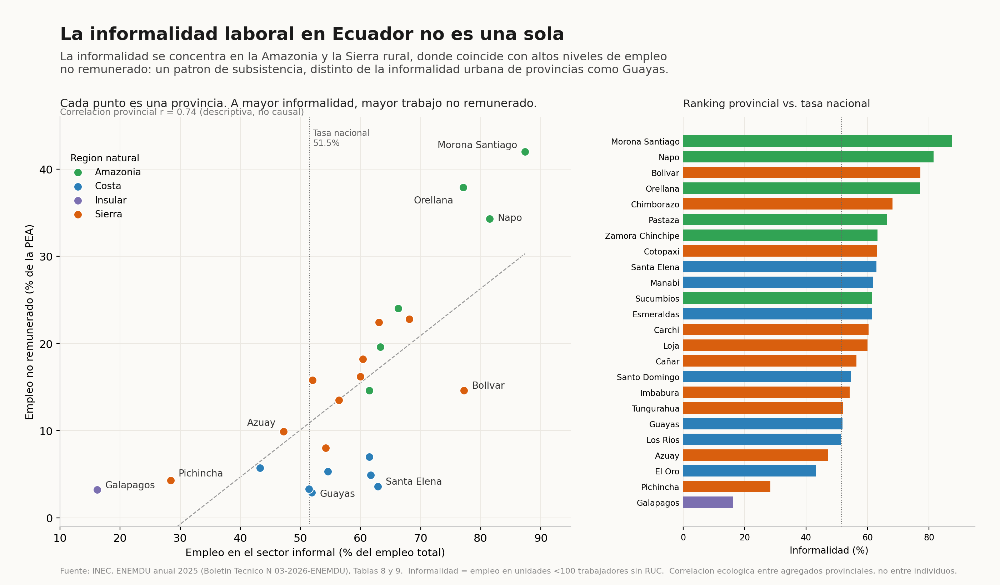

# La informalidad laboral en Ecuador no es una sola

Análisis y visualización reproducible de la informalidad laboral y el empleo no remunerado por provincia en Ecuador, a partir de datos oficiales del INEC (ENEMDU Anual 2025).

---

## Resumen

**La informalidad laboral en Ecuador no es una sola** es un proyecto de análisis y visualización de datos sobre informalidad laboral y empleo no remunerado por provincia en Ecuador.

El objetivo es responder la pregunta:

> **¿Se distribuye la informalidad laboral de manera uniforme en Ecuador, y qué relación tiene con el empleo no remunerado a nivel provincial?**

La visualización final se construye a partir de datos provinciales de empleo provenientes de la **ENEMDU Anual 2025 del INEC**, siguiendo un flujo reproducible de descarga, extracción, limpieza, validación y generación del gráfico.

---

## Mensaje principal

La informalidad **no** es uniforme en el territorio: el promedio nacional ponderado es **51,5%**, pero a nivel provincial va de **16,2% (Galápagos)** a **87,4% (Morona Santiago)**. Las provincias más informales se concentran en la **Amazonía** y la **Sierra rural**, donde la informalidad coincide con altas tasas de **empleo no remunerado** (correlación provincial r = 0,74 en 2025; r = 0,72 en 2024). Esto sugiere una **informalidad de subsistencia** (trabajo familiar no pagado), distinta de la informalidad urbano-empresarial de provincias como Guayas (informalidad media, no remunerado mínimo: 2,9%).

Este hallazgo se comunica mediante una **figura estática compuesta**, con énfasis en dos dimensiones por provincia: el porcentaje de empleo en el sector informal y el porcentaje de empleo no remunerado, coloreadas por región natural.

---

## Visualización final

La figura principal generada por el proyecto es:



**Archivos generados:**

```text
output/informalidad_ecuador.png
output/informalidad_ecuador.svg
```

El PNG es la versión para revisión rápida o publicación web; el **SVG** es la versión vectorial/editable de la misma figura.

**Qué muestra el gráfico:**

- Un **scatter principal**: cada punto es una provincia, posicionada según su informalidad (eje X) y su empleo no remunerado (eje Y), coloreada por región natural (Costa, Sierra, Amazonía, Insular), con línea de tendencia descriptiva.
- Una línea vertical con la **tasa nacional ponderada** de informalidad (51,5%) como referencia.
- Un **panel de barras** secundario con el ranking provincial de informalidad, comparado contra esa misma tasa nacional.

**Cómo leerlo:**

1. Mira el scatter de izquierda a derecha: a mayor informalidad, tiende a haber mayor empleo no remunerado (nube ascendente).
2. Fíjate en el color: los puntos de la Amazonía (verde) se ubican arriba a la derecha (alta informalidad + alto no remunerado); la Costa urbana (azul) aparece a media altura en X pero bajo en Y.
3. Usa el panel de barras para situar cada provincia frente a la tasa nacional (51,5%): por encima están las más informales; por debajo, los polos formales (Pichincha, Galápagos).

---

## Fuente de datos

| Elemento | Detalle |
| --- | --- |
| Fuente principal | ENEMDU (Encuesta Nacional de Empleo, Desempleo y Subempleo), Anual 2025 |
| Institución / entidad | INEC (Instituto Nacional de Estadística y Censos), Ecuador |
| Documento, base o dataset | Boletín Técnico N° 03-2026-ENEMDU (Tablas 8 y 9) |
| URL oficial | https://www.ecuadorencifras.gob.ec/documentos/web-inec/EMPLEO/2025/anual/Boletin_tecnico_anual_enero-diciembre_2025.pdf |
| Periodo analizado | Anual 2025 (con comparativo 2024) |
| Nivel de desagregación | Provincial (24 provincias) |
| Formato original | PDF (Tablas 8 y 9) |
| Licencia / uso | Creative Commons Atribución 4.0 Internacional (CC BY 4.0) |
| Fecha de descarga | 23/06/2026 |

El proyecto usa una **única fuente oficial**; no se emplean fuentes secundarias.

---

## Datos utilizados

El archivo de datos procesado se encuentra en:

```text
data/enemdu_anual_2025_provincial.csv
```

### Diccionario de datos

| Columna | Descripción | Tipo de dato | Fuente / cálculo |
| --- | --- | --- | --- |
| `provincia` | Nombre de la provincia | Texto | Tablas 8 y 9 del boletín |
| `region_natural` | Región natural (Costa / Sierra / Amazonía / Insular) | Texto | Clasificación geográfica **añadida por el proyecto**, NO proviene del PDF |
| `informalidad_2024` | Empleo en el sector informal, 2024 (% del empleo total) | Float | Tabla 9 |
| `informalidad_2025` | Empleo en el sector informal, 2025 (% del empleo total) | Float | Tabla 9 |
| `no_remunerado_2024` | Empleo no remunerado, 2024 (% de la PEA) | Float | Tabla 8 |
| `no_remunerado_2025` | Empleo no remunerado, 2025 (% de la PEA) | Float | Tabla 8 |

### Vista previa del CSV

> Muestra representativa (6 de 24 filas). El dataset completo está en `data/enemdu_anual_2025_provincial.csv`.

| provincia | region_natural | informalidad_2025 | no_remunerado_2025 |
| --- | --- | ---: | ---: |
| Azuay | Sierra | 47.2 | 9.9 |
| Bolivar | Sierra | 77.2 | 14.6 |
| Guayas | Costa | 51.9 | 2.9 |
| Morona Santiago | Amazonia | 87.4 | 42.0 |
| Pichincha | Sierra | 28.4 | 4.3 |
| Galapagos | Insular | 16.2 | 3.2 |

### Ejemplo de estructura CSV

```csv
provincia,region_natural,informalidad_2024,informalidad_2025,no_remunerado_2024,no_remunerado_2025
Morona Santiago,Amazonia,83.3,87.4,35.3,42.0
```

---

## Metodología

El análisis sigue este flujo:

```text
Fuente oficial (PDF del INEC)
   ↓
Descarga o lectura del archivo original
   ↓
Extracción de las Tablas 8 y 9
   ↓
Limpieza y estandarización
   ↓
Validación de valores clave
   ↓
Generación del CSV procesado
   ↓
Creación de la visualización final
   ↓
Exportación en PNG/SVG
```

### Pasos metodológicos

1. **Obtención:** se descarga el boletín oficial en PDF desde el portal del INEC (o se usa un PDF local).
2. **Extracción:** `src/extraer_datos.py` lee el PDF con `pdfplumber` y reconstruye las Tablas 8 (no remunerado) y 9 (informalidad). Como el texto mezcla columnas, figuras y notas, el parser usa que ambas tablas van seguidas: la **primera** aparición de cada provincia es no remunerado y la **segunda**, informalidad.
3. **Limpieza:** se normalizan nombres (tildes), se convierten los porcentajes a `float` y se añade la columna `region_natural`.
4. **Validación:** `src/validar_datos.py` exige 24 provincias, columnas requeridas, valores ancla y correlaciones esperadas antes de graficar.
5. **Análisis:** se calcula la correlación provincial informalidad–no remunerado (2024 y 2025) y se compara cada provincia con la tasa nacional ponderada (51,5%).
6. **Visualización:** figura estática compuesta (scatter + ranking) con estética sobria editorial, exportada en PNG y SVG.

---

## Reproducibilidad

El proyecto puede reproducirse por varias rutas:

### Ruta rápida: usar CSV incluido

Esta ruta usa el CSV ya procesado y verificado incluido en el repositorio.

```bash
python run.py --fuente csv
```

### Ruta completa: reconstruir CSV desde la fuente oficial

Esta ruta descarga el PDF oficial del INEC y reconstruye el CSV antes de generar el gráfico.

```bash
python run.py --fuente pdf --url "https://www.ecuadorencifras.gob.ec/documentos/web-inec/EMPLEO/2025/anual/Boletin_tecnico_anual_enero-diciembre_2025.pdf"
```

### Ruta con archivo local

Usar esta opción si el PDF original ya fue descargado manualmente a `data/raw/`.

```bash
python run.py --fuente pdf --pdf data/raw/boletin_enemdu_anual_2025.pdf
```

> El flujo desde PDF nunca sobrescribe el CSV de referencia: genera `data/enemdu_desde_pdf.csv`. También puedes graficar a partir de ese CSV con `python run.py --fuente csv --csv data/enemdu_desde_pdf.csv`.

---

## Instalación y ejecución

### Prerrequisitos

- Python 3.11 o superior.
- Git, si se clona el repositorio.
- Acceso a internet si se desea descargar la fuente oficial automáticamente.

### Clonar el repositorio

```bash
git clone {{PENDIENTE_URL_REPOSITORIO}}
cd "Tarea - El Quantificador"
```

### Crear entorno e instalar dependencias

Se recomienda un entorno virtual `.venv` y **no** instalar paquetes globalmente.

#### Linux / macOS

```bash
bash setup.sh
```

Luego activa el entorno según tu shell:

```bash
# Bash / Zsh (shell por defecto en la mayoría de Linux y en macOS)
source .venv/bin/activate

# Fish
source .venv/bin/activate.fish
```

#### Windows CMD

```bat
setup.bat
.venv\Scripts\activate.bat
```

#### Windows PowerShell

```powershell
# Si PowerShell bloquea scripts, primero:
#   Set-ExecutionPolicy -Scope Process -ExecutionPolicy Bypass
.\setup.ps1
.venv\Scripts\Activate.ps1
```

> **PyCharm:** abre la carpeta del proyecto y configura el intérprete en `.venv`
> (Settings → Project → Python Interpreter). Luego clic derecho sobre `run.py` → Run,
> o usa la Terminal con el entorno activado.

### Ejecutar el proyecto

Desde CSV procesado:

```bash
python run.py --fuente csv
```

Desde fuente oficial:

```bash
python run.py --fuente pdf --url "https://www.ecuadorencifras.gob.ec/documentos/web-inec/EMPLEO/2025/anual/Boletin_tecnico_anual_enero-diciembre_2025.pdf"
```

Desde archivo local:

```bash
python run.py --fuente pdf --pdf data/raw/boletin_enemdu_anual_2025.pdf
```

---

## Validación

El proyecto incluye controles para verificar que los datos extraídos o procesados sean consistentes antes de generar la figura.

| Validación | Resultado esperado |
| --- | --- |
| Número de observaciones | 24 provincias |
| Columnas requeridas | `provincia`, `region_natural`, `informalidad_2024`, `informalidad_2025`, `no_remunerado_2024`, `no_remunerado_2025` |
| Valor de control 1 | Morona Santiago: informalidad 87,4 / no remunerado 42,0 |
| Valor de control 2 | Galápagos: 16,2 / 3,2 · Guayas: 51,9 / 2,9 · Azuay: 47,2 / 9,9 |
| Indicador calculado | Correlación informalidad–no remunerado: r ≈ 0,741 (2025) y r ≈ 0,717 (2024) |

Ejecutar validaciones:

```bash
python src/validar_datos.py
```

Si una validación falla, el programa indica el dato conflictivo (provincia, columna, valor esperado y obtenido) y se detiene antes de generar una visualización incorrecta.

---

## Estructura del repositorio

```text
Tarea - El Quantificador/
├── README.md                              # Documentación principal del proyecto
├── requirements.txt                       # Dependencias de Python
├── run.py                                 # Orquestador del flujo completo (multiplataforma)
├── run.sh                                 # Atajo de ejecución para Linux/macOS
├── setup.sh / setup.bat / setup.ps1       # Instalación por sistema operativo
├── data/
│   ├── enemdu_anual_2025_provincial.csv   # CSV de referencia (verificado a mano)
│   ├── enemdu_desde_pdf.csv               # CSV generado desde el PDF oficial
│   ├── FUENTE.txt                         # Detalles de fuente, URL y fecha de descarga
│   └── raw/                               # PDF oficial (ver LEEME.txt)
├── src/
│   ├── extraer_datos.py                   # Extracción PDF → CSV (Tablas 8 y 9)
│   ├── validar_datos.py                   # Validaciones de consistencia
│   └── grafico.py                         # Generación de la visualización
├── tests/
│   ├── test_extraccion.py                 # Prueba el parser contra texto real del PDF
│   └── fixture_texto_pdf.txt              # Texto crudo del PDF para la prueba
└── output/
    ├── informalidad_ecuador.png
    ├── informalidad_ecuador.svg
    └── debug/texto_extraido_pdf.txt       # Texto leído del PDF, para depurar
```

---

## Archivos generados

| Archivo | Descripción | Formato |
| --- | --- | --- |
| `output/informalidad_ecuador.png` | Visualización final para revisión rápida o publicación web | PNG |
| `output/informalidad_ecuador.svg` | Versión vectorial/editable de la visualización | SVG |
| `data/enemdu_desde_pdf.csv` | Dataset reconstruido desde el PDF oficial | CSV |
| `output/debug/texto_extraido_pdf.txt` | Texto crudo leído del PDF (evidencia de extracción) | TXT |

---

## Stack tecnológico

| Componente | Tecnología                                                |
| --- |-----------------------------------------------------------|
| Lenguaje principal | Python                                                    |
| Limpieza y análisis | pandas                                                    |
| Visualización | matplotlib                                                |
| Extracción de datos | pdfplumber                                                |
| Reproducibilidad | Entorno virtual `.venv`, scripts de setup multiplataforma |
| Control de versiones | Git y GitHub                                              |
| IDE sugerido | PyCharm o VsCode                                          |

---

## Sobre la fuente

La **ENEMDU** (Encuesta Nacional de Empleo, Desempleo y Subempleo) es la encuesta oficial con la que el **INEC**, organismo oficial de estadística del Ecuador, mide el mercado laboral del país. En este proyecto, el **empleo en el sector informal** se define administrativamente: personas ocupadas en unidades productivas de menos de 100 trabajadores **sin** RUC. No es un juicio de calidad del empleo, sino una clasificación administrativa. El **empleo no remunerado** son los ocupados que no perciben ingresos (p. ej. trabajo familiar), medido como porcentaje de la PEA.

El alcance del análisis es un **corte provincial anual**: compara provincias entre sí en 2024 y 2025, pero no sigue a las mismas personas en el tiempo (no es longitudinal a nivel de individuo).

---

## Decisiones técnicas

- **CSV de referencia además del PDF:** `enemdu_anual_2025_provincial.csv` fue verificado a mano contra las Tablas 8 y 9 y es la fuente de verdad; el extractor reconstruye un CSV paralelo que debe coincidir con él (lo comprueba el test). Así la pieza es reproducible aunque cambie la maquetación del PDF.
- **Parser por invariante, no por “lectura de tablas”:** frente a un texto que mezcla columnas, figuras y notas, leer tablas es frágil; se usa que las Tablas 8 y 9 van seguidas (primera aparición = no remunerado, segunda = informalidad).
- **PNG y SVG:** PNG para revisión y web; SVG para edición vectorial sin pérdida.
- **Figura estática, no dashboard:** pieza editorial única y autoexplicativa, no una herramienta interactiva.
- **Validaciones automáticas:** evitan publicar datos mal extraídos.

---

## Limitaciones

- El análisis es un **corte transversal** (2024 y 2025): el segundo año muestra estabilidad del patrón, no una evolución ni una relación causal.
- Es una **correlación ecológica** entre agregados provinciales; no permite concluir comportamientos a nivel de individuo.
- La **región natural** es una clasificación añadida por el proyecto, no un dato del INEC.
- **Galápagos es atípica** (economía insular, distinto costo de vida) y puede comportarse como caso aparte.

---

## Cómo interpretar correctamente los resultados

- **Correlación no implica causalidad:** que informalidad y empleo no remunerado suban juntos a nivel provincial no prueba que uno cause al otro.
- **Un promedio nacional oculta diferencias territoriales:** el 51,5% nacional convive con provincias entre 16,2% y 87,4%.
- **51,5% es la tasa nacional ponderada**, no el promedio simple de las 24 provincias (≈58,6%); no deben confundirse.
- **Una variable administrativa no equivale a una condición social completa:** “informalidad” aquí es una definición administrativa (unidades <100 trabajadores sin RUC), no una medida directa de precariedad.

---

## Posibles mejoras futuras

- Cruzar la informalidad con un indicador de **ruralidad** provincial para contrastar la lectura de “subsistencia”.
- Extender a una **serie multi-año** (más allá de 2024–2025) para distinguir tendencia de ruido.
- Añadir **pruebas de significancia** a las diferencias entre años y a la correlación.

Estas mejoras son opcionales y no son necesarias para reproducir el resultado principal.

---

## Autoría

Proyecto desarrollado por **Juan Diego Sotomayor**.

| Dato | Detalle                                  |
| --- |------------------------------------------|
| Universidad | UEES                                     |
| Carrera | Ingeniería en Ciencias de la Computación |


---